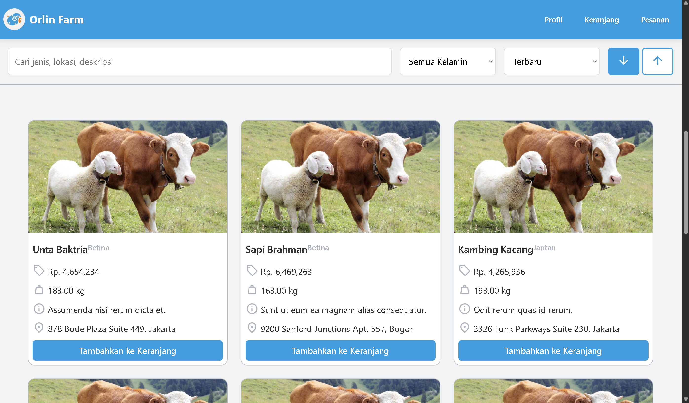
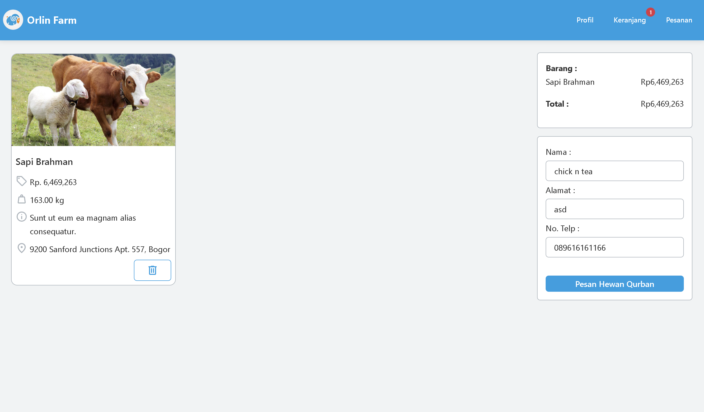
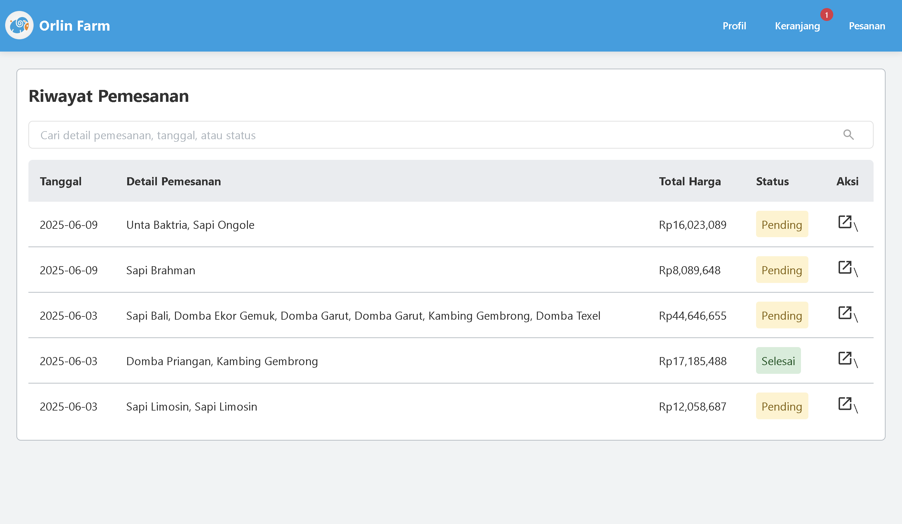
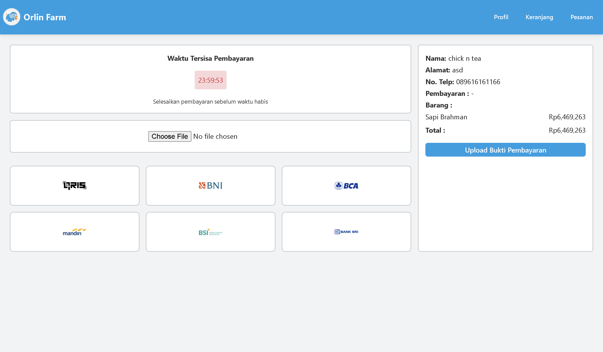
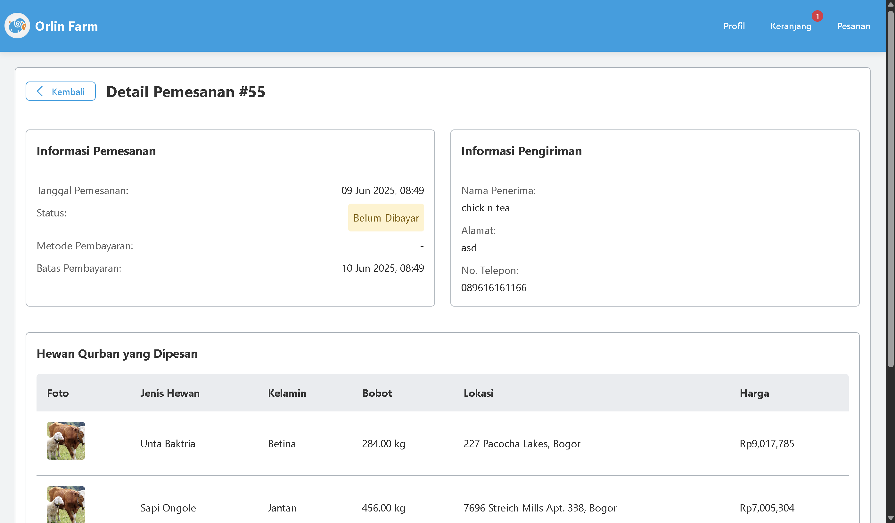
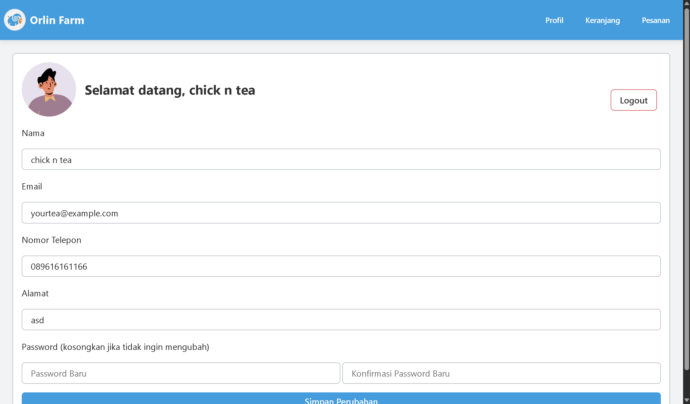
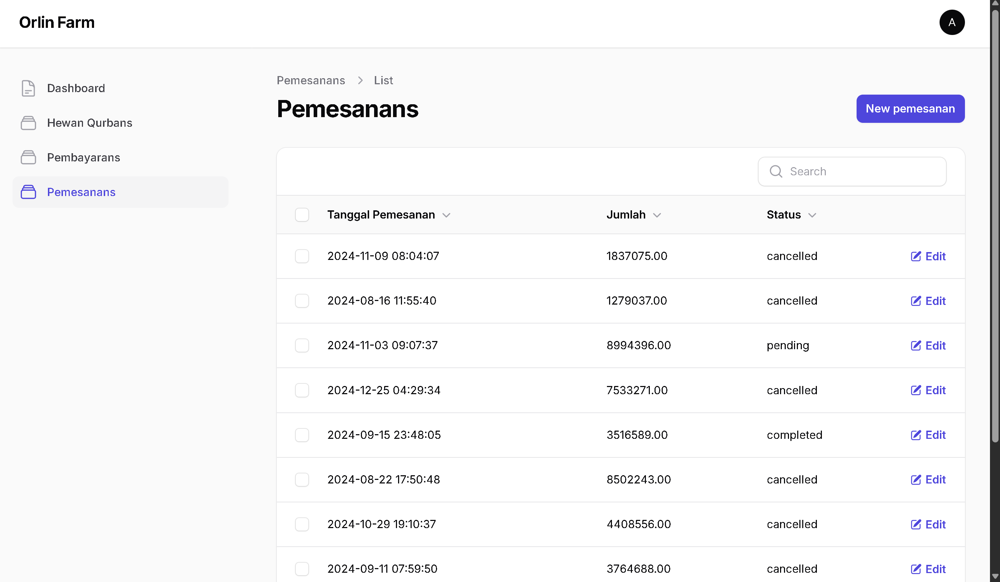

# Orlin Farm (Platform Bisnis Beli Hewan Qurban Online) - RPL Kelompok 3 P1

## Anggota Kelompok
* Daffa Aulia Musyaffa Subyantoro - G6401231028 (Backend)
* Muhammad Ihsan Fadhillah - G6401231053 (Frontend)
* Nibras Ramzy - G6401231108 (Backend)
* Mohammad Mirza Shahbaz Avianto - G6401231143 (Frontend)
* Muhammad Naufal Ramadhan - G6401231071 (Frontend)

## Apa itu Orlin Farm?
Orlin farm merupakan sebuah bisnis yang menawarkan layanan jual beli hewan qurban secara online, dengan cakupan utama wilayah Jabodetabek. Hingga saat ini sistem pemesanan dan verifikasi Orlin Farm masih dilakukan secara manual melalui media sosial dan aplikasi pesan singkat. Kondisi ini berpotensi menimbulkan tumpang tindih pesanan, kesalahan pencatatan transaksi, serta terbatasnya jangkauan pasar. Oleh karena itu, website ini dapat menampilkan informasi produk, juga menyediakan fitur pemesanan, pembayaran, dan verifikasi yang efisien dan intuitif, sehingga mampu menyelesaikan permasalahan yang ada sekaligus memberikan manfaat bagi konsumen dan pengelola secara berkelanjutan. Melalui website ini, proses bisnis Orlin Farm menjadi lebih terstruktur, cepat, dan mampu menjangkau lebih banyak pelanggan.

## Class Diagram


## Tampilan Fitur-fitur
### 1. Landing Page

### 2. Etalase

### 3. Login Pelanggan

### 4. Register Pelanggan

### 5. Keranjang

### 6. Riwayat Pemesanan

### 7. Pembayaran

### 8. Detail Pemesanan

### 9. Profil User

### 10. Admin Login

### 10. Admin Dashboard

### 11. Admin Dashboard (Daftar Hewan Qurban)

### 12. Admin Dashboard (Daftar Pemesanan)

### 13. Admin Dashboard (Daftar Pembayaran)


## Requirements
* PHP >= 8.2
* Composer
* MySQL Server
* NodeJS dan npm
* Laragon

## Instalasi
### 1. Start Laragon Webserver
* Buka Aplikasi [Laragon](https://laragon.org/) untuk local development.
* Tekan tombol **Start All**
* Pastikan MySQL aktif
* Buka terminal laragon
### 2. Clone Repository
```bash
    git clone https://github.com/Daulyoi/orlin-farm-rpl.git
    cd orlin-farm-rpl
```
### 3. Install PHP Dependencies
```bash
    composer install
```
### 4. Configure .env
* Copy file .env.example dan rename menjadi .env 
* Sesuaikan pengaturan Database dengan MySQL pada local machine anda 
```dotenv
    DB_CONNECTION=mysql
    DB_HOST=127.0.0.1
    DB_PORT=3306
    DB_DATABASE=your_database_name
    DB_USERNAME=your_username
    DB_PASSWORD=your_password
```
### 5. Generate Application Key
```bash
    php artisan key:generate
```
### 6. Run Migrations (with seed if needed)
```bash
    php artisan migrate
    #optional: php artisan db:seed
```
### 7. Install Frontend Dependencies
```bash
    npm install
    npm run dev
```
### 8. Run on Local
```bash
    php artisan serve
```
Navigasi ke [http://127.0.0.1:8000] pada browser.

## Common Issues
* Missing PHP Extension: can be found in php.ini in the coresponding php folder in laragon
